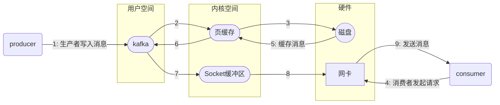
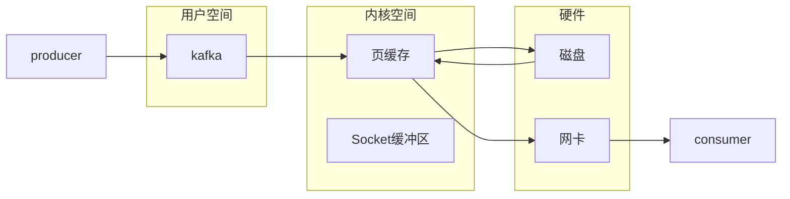
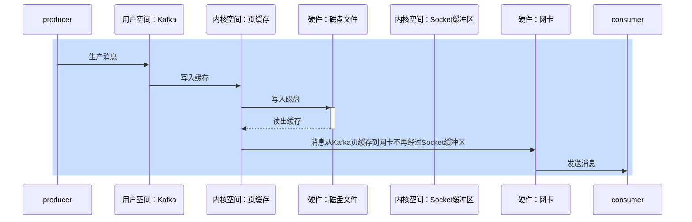

## 消息中间件面试题-参考回答

### RabbitMQ

#### RabbitMQ-如何保证消息不丢失

嗯！我们当时MYSQL和Redis的数据双写一致性就是采用RabbitMQ实现同步的，这里面就要求了消息的高可用性，我们要保证消息的不丢失。主要从三个层面考虑

第一个是开启生产者确认机制，确保生产者的消息能到达队列，如果报错可以先记录到日志中，再去修复数据

第二个是开启持久化功能，确保消息未消费前在队列中不会丢失，其中的交换机、队列、和消息都要做持久化

第三个是开启消费者确认机制为auto，由spring确认消息处理成功后完成ack，当然也需要设置一定的重试次数，我们当时设置了3次，如果重试3次还没有收到消息，就将失败后的消息投递到异常交换机，交由人工处理

> ```java
> // 交换机持久化：
> @Bean
> public DirectExchange simpleExchange(){
>     // 三个参数：交换机名称、是否持久化、当没有queue与其绑定时是否自动删除
>     return new DirectExchange("simple.direct", true, false);
> }
> // 队列持久化：
> @Bean
> public Queue simpleQueue(){
>     // 使用QueueBuilder构建队列，durable就是持久化的
>     return QueueBuilder.durable("simple.queue").build();
> }
> // 消息持久化，SpringAMQP中的的消息默认是持久的，可以通过MessageProperties中的DeliveryMode来指定的：
> Message msg = MessageBuilder
>     .withBody(message.getBytes(StandardCharsets.UTF_8)) // 消息体
>     .setDeliveryMode(MessageDeliveryMode.PERSISTENT) // 持久化
>     .build();
> ```
>
> SpringAMQP则允许配置三种确认模式：
>
> * manual：手动ack，需要在业务代码结束后，调用api发送ack。
>
> * auto：自动ack，由spring监测listener代码是否出现异常，没有异常则返回ack；抛出异常则返回nack
>
> * none：关闭ack，MQ假定消费者获取消息后会成功处理，因此消息投递后立即被删除

#### RabbitMQ消息的重复消费问题如何解决的

嗯，这个我们还真遇到过，是这样的，我们当时消费者是设置了自动确认机制，当服务还没来得及给MQ确认的时候，服务宕机了，导致服务重启之后，又消费了一次消息。这样就重复消费了

因为我们当时处理的支付（订单|业务唯一标识），它有一个业务的唯一标识，我们再处理消息时，先到数据库查询一下，这个数据是否存在，如果不存在，说明没有处理过，这个时候就可以正常处理这个消息了。如果已经存在这个数据了，就说明消息重复消费了，我们就不需要再消费了。

> MQ消息重复消费场景：网络抖动、消费者挂了

#### 其他的解决方案（幂等）

其实这个就是典型的幂等的问题，比如，redis分布式锁、数据库的锁都是可以的

#### RabbitMQ中死信交换机（延迟队列有了解过嘛）

我们当时的xx项目有一个xx业务，需要用到延迟队列，其中就是使用RabbitMQ来实现的。

延迟队列就是用到了死信交换机和TTL（消息存活时间）实现的。

如果消息超时未消费就会变成死信，在RabbitMQ中如果消息成为死信，队列可以绑定一个死信交换机，在死信交换机上可以绑定其他队列，在我们发消息的时候可以按照需求指定TTL的时间，这样就实现了延迟队列的功能了。

我记得RabbitMQ还有一种方式可以实现延迟队列，在RabbitMQ中安装一个死信插件，这样更方便一些，我们只需要在声明交互机的时候，指定这个就是死信交换机，然后在发送消息的时候直接指定超时时间就行了，相对于死信交换机+TTL要省略了一些步骤

> * 延迟队列：进入队列的消息会被延迟消费的队列
>
> * 场景：超时订单、限时优惠、定时发布
>
> ---
>
> 死信交换机
>
> 当一个队列中的消息满足下列情况之一时，可以成为死信（dead letter）：
>
> * 消费者使用basic.reject或 basic.nack声明消费失败，并且消息的requeue参数设置为false
>
> * 消息是一个过期消息，超时无人消费
>
> * 要投递的队列消息堆积满了，最早的消息可能成为死信
>
> 如果该队列配置了dead-letter-exchange属性，指定了一个交换机，那么队列中的死信就会投递到这个交换机中，而这个交换机称为死信交换机（Dead Letter Exchange，简称DLX）。
>
> ```java
> @Bean
> public Queue ttlQueue(){
>     return QueueBuilder.durable("simple.queue")	// 指定队列名称持久化
>         .ttl(10000)								// 设置队列的超时时间10秒
>         .deadLetterExchange("dl.direct")		// 指定死信交换机
>         .build();
> }
> ```
>
> ---
>
> TTL，也就是Time-To-Live。如果一个队列中的消息TTL结束仍未消费，则会变为死信，ttl超时分为两种情况：
>
> * 消息所在的队列设置了存活时间
>
> * 消息本身设置了存活时间
>
> ---
>
> DelayExchange插件，需要安装在RabbitMQ中
>
> RabbitMQ有一个官方的插件社区，地址为：https://www.rabbitmq.com/community-plugins.html 
>
> DelayExchange的本质还是官方的三种交换机，只是添加了延迟功能。因此使用时只需要声明一个交换机，交换机的类型可以是任意类型，然后设定delayed属性为true即可。
>
> ```java
> @RabbitListener(bindings = @QueueBinding(
> 	value = @Queue(name = "delay.queue", durable = "true"),
> 	exchange = @Exchange(name = "delay.direct", delayed = "true"),
>     key = "delay"
> ))
> public void listenDelayedQueue(String msg){
>     log.info("接收到 delay.queue的延时消息：{}", msg)
> }
> ```
>
> ```java
> // 创建消息
> Message message = MessageBuilder
>     .withBody("hello, delayed message".getBytes(StandardCharsets.UTF_8))
>     .setHeader("x-delay", 10000) //设置消息的死信时间
>     .build();
> // 消息ID，需要封装到CorrelattionData
> CorrelationData correlationData = new CorrelationData(UUID.randomUUID().toString);
> // 发生消息
> rabbitTemplate.converAndSend("delay.direct", "delay", message, correlationData);
> ```

#### 如果有100万消息堆积在MQ , 如何解决 ?

我在实际的开发中，没遇到过这种情况，不过，如果发生了堆积的问题，解决方案也所有很多的

第一:提高消费者的消费能力 ,可以使用多线程消费任务

第二：增加更多消费者，提高消费速度 

​			 使用工作队列模式, 设置多个消费者消费消费同一个队列中的消息

第三：扩大队列容积，提高堆积上限 

可以使用RabbitMQ惰性队列，惰性队列的好处主要是

①接收到消息后直接存入磁盘而非内存

②消费者要消费消息时才会从磁盘中读取并加载到内存

③支持数百万条的消息存储

> 惰性队列的特征如下：
>
> * 接收到消息后直接存入磁盘而非内存
>
> * 消费者要消费消息时才会从磁盘中读取并加载到内存
>
> * 支持数百万条的消息存储
>
> ```java
> @Bean
> public Queue lazyQueue(){
>     return QueueBuilder
>         .durable("lazy.queue")
>         .lazy() //开启x-queue-mode为lazy
>         .build();
> }
> ```
>
> ```java
> @RabbitListener(QueuesToDeclare = @Queue(
> 	name = "lazy.queue",
>     durable = "true",
>     arguments = @Argument(name = "x-queue-mode", value = "lazy")
> ))
> public void listenLazyQueue(String msg){
>     log.info("接收到 lazy.queue 的消息：{}", msg);
> }
> ```

#### RabbitMQ的高可用机制有了解过嘛

我们当时项目在生产环境下，使用的集群，当时搭建是镜像模式集群，使用了3台机器。

镜像队列结构是一主多从，所有操作都是主节点完成，然后同步给镜像节点，如果主节点宕机后，镜像节点会替代成新的主节点，不过在主从同步完成前，主节点就已经宕机，可能出现数据丢失

> 在生产环境下，使用集群来保证高可用性 => 普通集群、镜像集群、仲裁队列4
>
> 普通集群，或者叫标准集群（classic cluster），具备下列特征：
>
> * 会在集群的各个节点间共享部分数据，包括：交换机、队列元信息。不包含队列中的消息。
>
> * 当访问集群某节点时，如果队列不在该节点，会从数据所在节点传递到当前节点并返回
>
> * 队列所在节点宕机，队列中的消息就会丢失
>
> 镜像集群：本质是主从模式，具备下面的特征：
>
> * 交换机、队列、队列中的消息会在各个mq的镜像节点之间同步备份。
>
> * 创建队列的节点被称为该队列的**主节点，**备份到的其它节点叫做该队列的**镜像**节点。
>
> * 一个队列的主节点可能是另一个队列的镜像节点
>
> * 所有操作都是主节点完成，然后同步给镜像节点
>
> * 主宕机后，镜像节点会替代成新的主

#### 镜像集群出现丢数据怎么解决呢？

我们可以采用仲裁队列，与镜像队列一样，都是主从模式，支持主从数据同步，主从同步基于Raft协议，强一致。

并且使用起来也非常简单，不需要额外的配置，在声明队列的时候只要指定这个是仲裁队列即可

> 仲裁队列：仲裁队列是3.8版本以后才有的新功能，用来替代镜像队列，具备下列特征：
>
> * 与镜像队列一样，都是主从模式，支持主从数据同步
>
> * 使用非常简单，没有复杂的配置
>
> * 主从同步基于Raft协议，强一致
>
> ```java
> @Bean
> public Queue quorumQueue(){
>     return QueueBuilder
>         .durable("quorum.queue")	//持久化
>         .quorum()					//仲裁队列
>         .build();
> }
> ```

### Kafka

> Kafka介绍：一个 Kafka 实例可以有多个 Broker。Kafka 是一个分布式的消息系统，它通过将数据分割成多个分区并在多个 Broker 上进行分布式存储和处理来实现高吞吐量和可扩展性。每个 Broker 是一个独立的 Kafka 服务器实例，可以在不同的物理机器或虚拟机上运行。
>
> Broker介绍：Broker是 Kafka 消息系统的核心组件之一。它是一个独立的 Kafka 服务器实例，负责存储和处理消息。
>
> 每个 Broker 负责管理一部分的分区和消息存储。分区是 Kafka 中消息的逻辑单元，每个分区都是一个有序、不可变的消息日志。分区允许消息以并行的方式进行处理和存储，提高了消息系统的吞吐量和可扩展性。
>
> Kafka 集群：当你创建一个 Kafka 集群时，你可以启动多个 Broker 并将它们组成一个集群。每个 Broker 都负责管理一部分的分区和消息存储。在集群中，有一个 Broker 被选为主要（leader）节点，负责处理读写请求，并复制数据到其他 Broker（副本节点）中。当主要节点失效时，副本节点会被选举为新的主要节点，保证高可用性和故障恢复。
>
> 多个 Broker：通过将分区和副本分散在多个 Broker 上，Kafka 实现了负载均衡和故障容错。这样，你可以通过增加更多的 Broker 来扩展 Kafka 集群的处理能力和存储容量。同时，多个 Broker 之间的数据复制和同步机制保证了消息的可靠性和一致性。
>
> 总结：Kafka 允许你创建一个由多个 Broker（代理） 组成的集群，Broker 是 Kafka 集群中的独立服务器实例，负责存储和处理消息，并通过分区和副本实现高吞吐量、可扩展性和可靠性的分布式消息处理能力。

#### Kafka是如何保证消息不丢失

嗯，这个保证机制很多，在发送消息到消费者接收消息，在每个阶段都有可能会丢失消息，所以我们解决的话也是从多个方面考虑

第一个是生产者发送消息的时候，可以使用异步回调发送，如果消息发送失败，我们可以通过回调获取失败后的消息信息，可以考虑重试或记录日志，后边再做补偿都是可以的。同时在生产者这边还可以设置消息重试，有的时候是由于网络抖动的原因导致发送不成功，就可以使用重试机制来解决

第二个在broker中消息有可能会丢失，我们可以通过kafka的复制机制来确保消息不丢失，在生产者发送消息的时候，可以设置一个acks，就是确认机制。我们可以设置参数为all，这样的话，当生产者发送消息到了分区之后，不仅仅只在leader分区保存确认，在follwer分区也会保存确认，只有当所有的副本都保存确认以后才算是成功发送了消息，所以，这样设置就很大程度了保证了消息不会在broker丢失

第三个有可能是在消费者端丢失消息，kafka消费消息都是按照offset进行标记消费的，消费者默认是自动按期提交已经消费的偏移量，默认是每隔5s提交一次，如果出现重平衡的情况，可能会重复消费或丢失数据。我们一般都会禁用掉自动提价偏移量，改为手动提交，当消费成功以后再报告给broker消费的位置，这样就可以避免消息丢失和重复消费了

> 生产者消息发送重试
>
> ```java
> // 同步发送
> RecordMetadata recordMetadata = kafkaProducer.send(record).get();
> // 异步发送
> kafkaProducer.send(record, new Callback() {
>     @Override
>     public void onCompletion(RecordMetadata recordMetadata, Exception e) {
>         if (e != null) {
>             System.out.println("消息发送失败 | 记录日志");
>         }
>         long offset = recordMetadata.offset();
>         int partition = recordMetadata.partition();
>         String topic = recordMetadata.topic();
>     }
> });
> ```
>
> ```java
> // 设置重试次数
> prop.put(ProducerConfig.RETRIES_CONFIG,10);
> ```
>
> 消息在Brocker中发送确认
>
> | **确认机制**     | **说明**                                                     |
> | ---------------- | ------------------------------------------------------------ |
> | acks=0           | 生产者在成功写入消息之前不会等待任何来自服务器的响应,消息有丢失的风险，但是速度最快 |
> | acks=1（默认值） | 只要集群首领节点收到消息，生产者就会收到一个来自服务器的成功响应 |
> | acks=all         | 只有当所有参与赋值的节点全部收到消息时，生产者才会收到一个来自服务器的成功响应 |
>
> 消费者从Brocker接收消息
>
> * Kafka 中的分区机制指的是将每个主题（topic）划分成多个分区（Partition）
>
> * topic分区中消息只能由消费者组中的唯一的一个消费者处理，不同的分区分配给不同的消费者（同一个消费者组）
>
> 消费者默认是自动按期提交已经消费的偏移量，默认是每隔5s提交一次。如果出现重平衡的情况，可能会重复消费或丢失数据
>
> 禁用自动提交偏移量，改为手动
>
> 同步提交、异步提交、同步+异步组合提交
>
> ```java
> try {
>     while (true) {
>         ConsumerRecords<String, String> records = consumer.poll(Duration.ofMillis(1000));
>         for(ConsumerRecords<String, String> record: records) {
>             System.out.println(record.key + record.value);
>         }
>         comsumer.commitASync();		//异步提交
>     }
> } catch (Exception e){
>     e.printStackTrace();
> } finally {
>     try {
>         comsumer.commitSync();		//同步提交
>     } finally {
>         comsumer.close();
>     }
> }
> ```

#### Kafka中消息的重复消费问题如何解决的

kafka消费消息都是按照offset进行标记消费的，消费者默认是自动按期提交已经消费的偏移量，默认是每隔5s提交一次，如果出现重平衡的情况，可能会重复消费或丢失数据。我们一般都会禁用掉自动提价偏移量，改为手动提交，当消费成功以后再报告给broker消费的位置，这样就可以避免消息丢失和重复消费了

为了消息的幂等，我们也可以设置唯一主键来进行区分，或者是加锁，数据库的锁，或者是redis分布式锁，都能解决幂等的问题

#### Kafka是如何保证消费的顺序性

kafka默认存储和消费消息，是不能保证顺序性的，因为一个topic数据可能存储在不同的分区中，每个分区都有一个按照顺序的存储的偏移量，如果消费者关联了多个分区不能保证顺序性。

如果有这样的需求的话，我们是可以解决的，把消息都存储同一个分区下就行了，有两种方式都可以进行设置，第一个是发送消息时指定分区号。

第二个是发送消息时按照相同的业务设置相同的key，因为默认情况下分区也是通过key的hashcode值来选择分区的，hash值如果一样的话，分区肯定也是一样的

> 应用场景：
>
> * 即时消息中的单对单聊天和群聊，保证发送方消息发送顺序与接收方的顺序一致
>
> * 充值转账两个渠道在同一个时间进行余额变更，短信通知必须要有顺序

#### Kafka的高可用机制有了解过嘛

嗯，主要是有两个层面，第一个是集群，第二个是提供了分区复制机制

kafka集群指的是由多个broker实例组成，即使某一台宕机，也不耽误其他broker继续对外提供服务

复制机制是可以保证kafka的高可用的，一个topic有多个分区，每个分区有多个副本，有一个leader，其余的是follower，副本存储在不同的broker中；所有的分区副本的内容是都是相同的，如果leader发生故障时，会自动将其中一个follower提升为leader，保证了系统的容错性、高可用性。

#### 解释一下复制机制中的ISR

ISR的意思是in-sync replica，就是需要同步复制保存的follower

其中分区副本有很多的follower，分为了两类，一个是ISR，与leader副本同步保存数据，另外一个普通的副本，是异步同步数据，当leader挂掉之后，会优先从ISR副本列表中选取一个作为leader，因为ISR是同步保存数据，数据更加的完整一些，所以优先选择ISR副本列表。

>  Kafka 安装目录/config/ server.properties
>
> ```properties
> #一个topic默认分区的replication个数，不能大于集群中broker的个数。默认为1
> default.replication.factor=3
> #最小的ISR副本个数
> min.insync.replicas=2
> ```

#### Kafka数据清理机制了解过嘛

Kafka中topic的数据存储在分区上，分区如果文件过大会分段存储segment

每个分段都在磁盘上以索引(xxxx.index)和日志文件(xxxx.log)的形式存储，这样分段的好处是，第一能够减少单个文件内容的大小，查找数据方便，第二方便kafka进行日志清理。

在kafka中提供了两个日志的清理策略：

第一，根据消息的保留时间，当消息保存的时间超过了指定的时间，就会触发清理，默认是168小时（ 7天）

第二是根据topic存储的数据大小，当topic所占的日志文件大小大于一定的阈值，则开始删除最久的消息。这个默认是关闭的

这两个策略都可以通过kafka的broker中的配置文件进行设置

> Kafka文件存储机制：为什么要分段？
>
> * 删除无用文件方便，提高磁盘利用率
>
> * 查找数据便捷
>
> ```properties
> drwxr-xr-x. 2 root root 141 4月 25 20:06 itheima-0
> drwxr-xr-x. 2 root root 141 4月 25 20:06 itheima-1
> drwxr-xr-x. 2 root root 141 4月 25 20:06 itheima-2
> ```
>
> ```properties
> 00000000000000000000.index		索引文件
> 00000000000000000000.log		数据文件
> 00000000000000000000.timeindex	时间索引文件
> ```
>
> 日志的清理策略有两个：
>
> * 保存的时间超过了指定的时间
>
> ```properties
> # The minimum age of a log file to be eligible for deletion due to age
> log.retention.hours=168
> ```
>
> * topic所占的日志文件大小大于一定的阈值，则开始删除最久的消息。需手动开启
>
> ```properties
> # A size-based retention policy for logs. Segments are pruned from the log unless the remaining
> # segments drop below log.retention.bytes. Functions independently of log.retention.hours.
> #log.retention.bytes=1073741824
> ```

#### Kafka中实现高性能的设计有了解过嘛

Kafka 高性能，是多方面协同的结果，包括宏观架构、分布式存储、ISR 数据同步、以及高效的利用磁盘、操作系统特性等。主要体现有这么几点：

消息分区：不受单台服务器的限制，可以不受限的处理更多的数据

顺序读写：磁盘顺序读写，提升读写效率

页缓存：把磁盘中的数据缓存到内存中，把对磁盘的访问变为对内存的访问

零拷贝：减少上下文切换及数据拷贝

消息压缩：减少磁盘IO和网络IO

分批发送：将消息打包批量发送，减少网络开销

> flowchart LR横向|TB树形

常规：



零拷贝：





